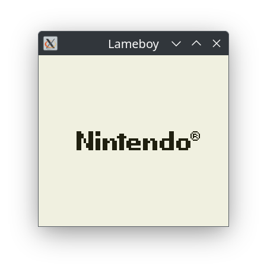

GameBoy DMG emulator
--------------------

## Usage

```bash
Usage: lameboy [OPTIONS] <CARTRIDGE>

Arguments:
  <CARTRIDGE>  Cartridge

Options:
  -d, --debug                    Enable debug mode
  -b, --breakpoint <BREAKPOINT>  Breakpoints
  -s, --step-by-step             Step by step
  -n, --nofps                    Skip FPS limiter
      --dump                     Dump opcode list to file
      --debug-vram               VRam debug window
  -h, --help                     Print help
  -V, --version                  Print version
```

- Dependencies: SDL2
- Tested OS: Linux, Windows
- Keyboard:
  - Up / Left / Down / Right: `W`, `A`, `S`, `D`
  - Start / Select: `Z`, `X`
  - A / B: `N`, `M`
  - Break execution: `B`
  - Quit: `Esc`

## Screenshots




## Materials

- Reference emulator:
  - https://bgb.bircd.org
- PDF:
  - https://gekkio.fi/files/gb-docs/gbctr.pdf
  - http://marc.rawer.de/Gameboy/Docs/GBCPUman.pdf
- Docs:
  - https://gbdev.gg8.se/
  - https://gbdev.io/pandocs/
  - https://rylev.github.io/DMG-01/public/book/cpu/register_data_instructions.html
  - https://www.pastraiser.com/cpu/gameboy/gameboy_opcodes.html
  - https://ez80.readthedocs.io/en/latest/docs/bit-shifts/rlca.html
  - https://realboyemulator.wordpress.com/2013/01/03/a-look-at-the-game-boy-bootstrap-let-the-fun-begin/
- Test roms:
  - https://github.com/retrio/gb-test-roms/tree/master
  - https://github.com/c-sp/gameboy-test-roms
